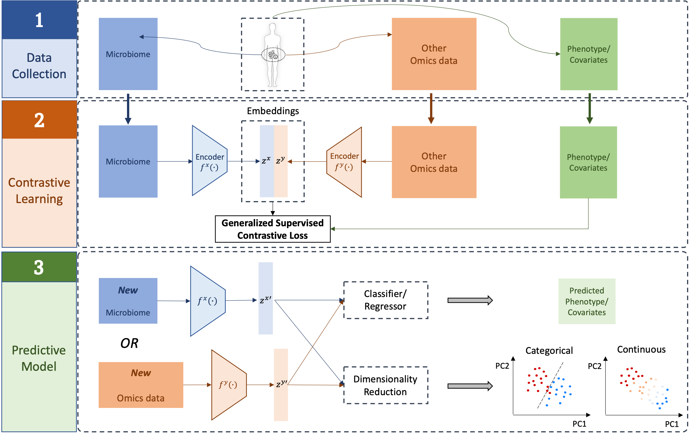

# MB-SupCon-cont: A Generalized Supervised Contrastive Learning Framework for Integrative Multi-omics Pre-diction Models

## Introduction

Advancements in multi-omics research have demonstrated the potential of integrating human mi-crobiome and metabolomics data to better understand physiological processes and improve predic-tion accuracy in studies of human health. While conventional models utilizing single-omics data provides valuable perspectives, they often fail to capture the complexity of biological systems. Re-cent developments in supervised contrastive learning frameworks have enhanced predictive perfor-mance for categorical covariates, yet limitations persist in extending these methods to continuous outcomes. A robust model capable of addressing these gaps could significantly enhance multi-omics predictions and provide new insights into complex biological interactions.

We present MB-SupCon-cont, a novel supervised contrastive learning framework designed for both categorical and continuous covariates in multi-omics data. MB-SupCon-cont improves prediction accuracy by incorporating a generalized contrastive loss function that defines similarity and dissimi-larity for continuous covariates. Through simulation studies and two real-world datasets for Type 2 Diabetes (T2D) and High-Fat Diet (HFD), we demonstrate that MB-SupCon-cont outperforms con-ventional models, consistently achieving lower prediction errors. The framework also provides su-perior representation learning, improving data visualization in lower-dimensional spaces. These findings suggest MB-SupCon-cont is a powerful tool for general multi-omics prediction purpose and can offer broad applicability in biomedical research.

<p align="center">
  
</p>

<p align="center">
  <b>Fig.1</b> MB-SupCon-cont: A Generalized Supervised Contrastive Learning Framework
</p>

## About this repository

**Folders**

There are three main folders in this repository. The detailed information of each folder is as follows.

"`T2D`" folder includes the scripts and jupyter notebooks used to train MB-SupCon-cont models, generate lower-dimensional PCA scatter plots, visualize and summarize the results for Type 2 Diabetes study.

"`HFD`" folder includes the scripts and jupyter notebooks used to train MB-SupCon-cont models, generate lower-dimensional PCA scatter plots, visualize and summarize the results for High-Fat Diet study.

"`Simulation`" folder includes the scripts and jupyter notebooks used to train MB-SupCon-cont models, visualize and summarize the results for simulation studies by Reversed PCA method.

**Data**

For "`T2D`" and "`HFD`" folders, all data used in this study is in "`./{STUDY}/data`", where `STUDY` $\in$ {`T2D`, `HFD`}.

For simulations studies, we include the script to generate the simulated data.

**Codes**

1.  Real-world studies: "`T2D`" and "`HFD`". In each folder,

- `MB-SupCon-cont_training.py`: the main Python script used to:

a. Train MB-SupCon-cont models for different covaraites;

*(Note: the best combination of hyperparameters are chosen based on the hyperparameter tuning result.)*

b. Output and save corresponding feature embedding in the representation domain;

c. Make predictions of different covariates based on MB-SupCon-cont embeddings and original data, and calculate the average prediction RMSE on testing datasets from multiple training-validation-testing splits;

d. Generate scatter plots on lower-dimensional space by PCA.

*(Note: you can choose other dimensionality reduction techniques, such as t-SNE and UMAP)*.

- `results_visualization_3.ipynb`: jupyter notebook used to visualize and summarize all the results.

- `supervised_loss.py`: the script used for calculating supervised contrastive loss;

- `mbsupcon_cont.py`: the python script for building a MB-SupCon-cont model;

- `utils_eval.py`: utility functions and classes.

2.  Simulation studies. Each of the three subfolders is corresponding to an average correlation coefficient $\mu_{\rho}$, where $\mu_{\rho}\in\{0.4,0.6,0.8\}$. For each scenario, the only difference is:

`MB-SupCon-cont_simulation.py` is used to generate necessary simulation data, train MB-SupCon-cont models and make predictions.

All other files are the same as those for real-world studies.

## Implementation

We provide a python [conda](https://docs.conda.io/projects/conda/en/latest/user-guide/tasks/manage-environments.html) environment used to train the model and generate all the results.

All deep contrastive learning models are trained using [PyTorch](https://pytorch.org/). 

- System information and package versions:

System: `Linux`;

Python version: `3.8.5`;

`pytorch`: `1.7.1` (Build: `py3.8_cuda11.0.221_cudnn8.0.5_0`);

GPU: `Tesla V100-SXM2-32GB`.

All other dependencies will be downloaded when the provided environment is imported.

### Clone Repository

```bash
git clone https://github.com/ya61sen/MB-SupCon-cont.git
cd MB-SupCon-cont
```

### Create and import Conda Environment

```bash
conda env create -f environment.yml
source activate envir_MB-SupCon-cont
```

### Run `MB-SupCon-cont_training.py` or `MB-SupCon-cont_simulation.py`

Basically, the procedures to train a MB-SupCon-cont model are very similar between studies. I will take `T2D` study with embedding dimensionality of 10 and linear weighting method as an example:

```bash
cd T2D
python MB-SupCon-cont_training.py --embedding_dim 10 --weighting_method linear
```

For simulation studies, you need to specify one more argument - the average correlation coefficient. Suppose we are running simulation studies when $\mu_{\rho}=0.4$, the embedding dimensionality is 10 and linear weighting method is used,

```bash
cd Simulation/corr04
python MB-SupCon-cont_simulation.py --embedding_dim 10 --weighting_method linear --correlation_coefficient 0.4
```

## Contacts

**Sen Yang:**

sky5218@psu.edu | syang4@pennstatehealth.psu.edu

Department of Public Health Sciences

Penn State College of Medicine

Hershy, PA 17033


