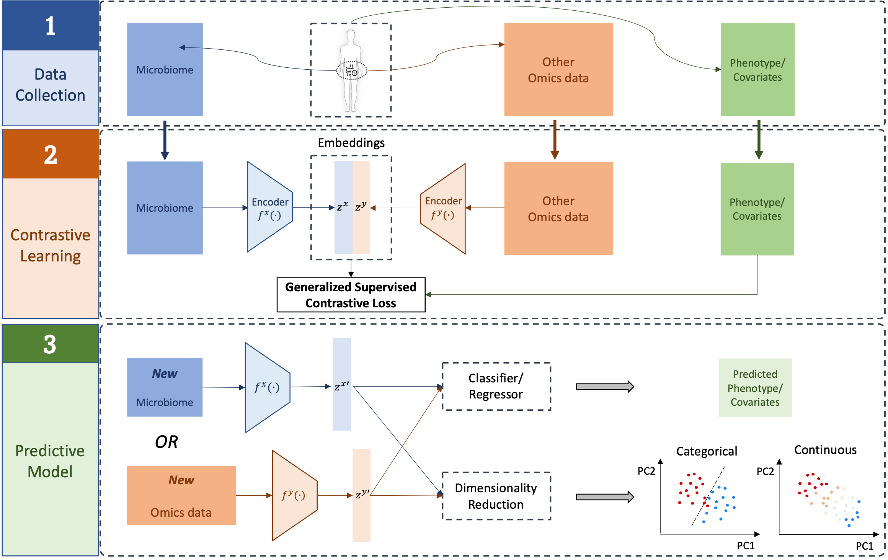

# MB-SupCon-cont  
### A Generalized Supervised Contrastive Learning Framework for Integrative Multi-omics Prediction Models

<p align="center">
  
</p>

<p align="center">
<b>Figure 1.</b> Overview of the MB-SupCon-cont framework for integrative multi-omics prediction.
</p>

---

## Overview

Advancements in **multi-omics research** have demonstrated the importance of integrating multiple biological data modalities—such as **microbiome** and **metabolomics**—to better understand physiological processes and improve predictive modeling in biomedical studies.

Traditional single-omics models often fail to capture the complexity of biological systems. While recent **supervised contrastive learning frameworks** have improved prediction for **categorical outcomes**, extending these approaches to **continuous covariates** remains challenging.

**MB-SupCon-cont** addresses this gap.

This repository implements **MB-SupCon-cont**, a generalized supervised contrastive learning framework that:

- Supports **both categorical and continuous outcomes**
- Improves **multi-omics predictive performance**
- Learns **high-quality representations**
- Enhances **low-dimensional visualization**

Through **simulation studies** and two real datasets:

- **Type 2 Diabetes (T2D)**
- **High-Fat Diet (HFD)**

MB-SupCon-cont consistently achieves **lower prediction errors** than conventional methods.

---

# Repository Structure

The repository contains three main project components.

```
MB-SupCon-cont/
│
├── T2D/              # Type 2 Diabetes study
├── HFD/              # High-Fat Diet study
└── Simulation/       # Simulation experiments
```

### T2D

Contains scripts and notebooks for:

- Training MB-SupCon-cont models
- Generating embeddings
- PCA visualization
- Result summarization

### HFD

Same workflow as the T2D study, applied to the **High-Fat Diet dataset**.

### Simulation

Simulation experiments evaluating model performance under different correlation structures.

Each subfolder corresponds to an **average correlation coefficient**

$begin:math:display$
\\mu\_\{\\rho\} \\in \\\{0\.4\, 0\.6\, 0\.8\\\}
$end:math:display$

---

# Data

### Real-world datasets

For **T2D** and **HFD** studies:

```
./{STUDY}/data
```

where

```
STUDY ∈ {T2D, HFD}
```

contains all necessary input data.

### Simulation data

Simulation datasets are **generated automatically** by the provided scripts.

---

# Code Description

## Real-World Studies (`T2D` and `HFD`)

Key scripts include:

### `MB-SupCon-cont_training.py`

Main script for:

- Training MB-SupCon-cont models
- Exporting learned **feature embeddings**
- Predicting covariates
- Computing **average RMSE** across train/validation/test splits
- Generating **PCA visualization plots**

Alternative dimensionality reduction methods can also be used:

- **t-SNE**
- **UMAP**

### `results_visualization_3.ipynb`

Notebook for summarizing and visualizing results.

### `supervised_loss.py`

Implements the **supervised contrastive loss function**.

### `mbsupcon_cont.py`

Core implementation of the **MB-SupCon-cont model architecture**.

### `utils_eval.py`

Utility functions for evaluation and analysis.

---

## Simulation Studies

Each simulation folder corresponds to a different **average correlation coefficient**.

Main script:

```
MB-SupCon-cont_simulation.py
```

Functions:

- Generate simulation datasets
- Train MB-SupCon-cont models
- Evaluate predictive performance

Other files are shared with the real-data pipelines.

---

# Installation

We provide a **Conda environment** for reproducibility.

All deep learning models are implemented using **PyTorch**.

## System configuration used in experiments

| Component | Version |
|---|---|
| OS | Linux |
| Python | 3.8.5 |
| PyTorch | 1.7.1 |
| GPU | Tesla V100-SXM2-32GB |

---

# Quick Start

## Clone the repository

```bash
git clone https://github.com/ya61sen/MB-SupCon-cont.git
cd MB-SupCon-cont
```

---

## Create the Conda environment

```bash
conda env create -f environment.yml
conda activate envir_MB-SupCon-cont
```

---

# Training MB-SupCon-cont

## Example: T2D Study

Train the model with:

- embedding dimension = 10
- linear weighting method

```bash
cd T2D
python MB-SupCon-cont_training.py \
    --embedding_dim 10 \
    --weighting_method linear
```

---

## Example: Simulation Study

When:

- embedding dimension = 10
- weighting method = linear
- average correlation coefficient = 0.4

```bash
cd Simulation
python MB-SupCon-cont_simulation.py \
    --embedding_dim 10 \
    --weighting_method linear \
    --correlation_coefficient 0.4
```

---

# Contact

**Sen Yang**

Department of Public Health Sciences  
Penn State College of Medicine  
Hershey, PA, USA

Email:

- sky5218@psu.edu  
- syang4@pennstatehealth.psu.edu

---

## Citation

If you use this code in your research, please cite the corresponding manuscript.

*(Citation will be added once the paper is published.)*